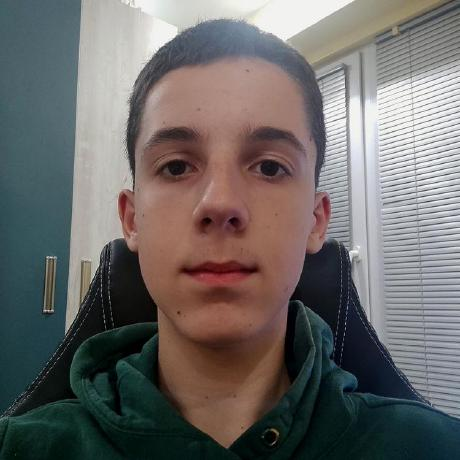

<div align="center">

# MontOlympiad

**An interactive electronic school system for learning and testing mathematical inequalities**


</div>

---

## Overview

MontOlympiad is a command-line educational application built in C++17 that guides students through the world of **mathematical inequalities**. It features:

- **User Authentication** — Secure sign-up and login with SHA256 hashed passwords
- **Learning Modules** — Structured lessons covering 6 inequality topics, from basic concepts to polynomial sign charts
- **Interactive Testing** — Randomized quizzes drawn from a JSON question bank with multiple-choice answers
- **Statistics Tracking** — Per-subject score history with lowest, highest, and average scores

---

## Technologies

| Tool | Purpose |
|------|---------|
| **C++17 / g++** | Core application language and compiler |
| **CMake** | Cross-platform build system (≥ 3.16) |
| **Git** | Version control |
| **GitHub** | Remote repository and collaboration |
| **PowerPoint** | Project presentation (`docs/Presentation.pptx`) |
| **Word** | Project documentation |

**Third-party libraries (bundled):**
- [`nlohmann/json`](https://github.com/nlohmann/json) — JSON parsing for user data, questions, and statistics
- [`picosha2`](https://github.com/okdshin/PicoSHA2) — SHA256 password hashing

---

## Team

<table align="center">
  <tr>
    <td align="center">
      <a href="https://github.com/vladosfluxi">
        <br/>
        <b>Vladimir Kosev</b>
      </a>
    </td>
    <td align="center">
      <a href="https://github.com/BGNuri24">
        <br/>
        <b>Beray Nuri</b>
      </a>
    </td>
    <td align="center">
      <a href="https://github.com/BSAndrikov24">
        <br/>
        <b>Borislav Andrikov</b>
      </a>
    </td>
    <td align="center">
      <a href="https://github.com/VZGospodinov24">
        <br/>
        <b>Vasilen Gospodinov</b>
      </a>
    </td>
  </tr>
</table>

---

## Installation

### Requirements

| Requirement | Version |
|-------------|---------|
| **CMake** | ≥ 3.16 |
| **C++ Compiler** | One of the following: |
| &nbsp;&nbsp;• g++ | ≥ 9 |
| &nbsp;&nbsp;• Clang | ≥ 10 |
| &nbsp;&nbsp;• MSVC (cl) | ≥ 19.20 (Visual Studio 2019) |
| **Git** | Any recent version |

### Building from Source

**1. Clone the repository**
```bash
git clone https://github.com/vladosfluxi/MontOlympiad.git
cd MontOlympiad
```

**2. Configure the build**
```bash
cmake -S ./ -B build
```


**3. Compile**
```bash
cmake --build build
```

**4. Run**
```bash
# Linux / macOS
./build/olympiad

# Windows
.\build\olympiad.exe
```

> **Note:** The data files (`users.json`, `math-questions.json`, `statistics.json`) are automatically copied to the build directory by CMake.

---

## Project Structure

```
MontOlympiad/
├── CMakeLists.txt
├── docs/
│   └── Presentation.pptx
└── src/
    ├── main.cpp
    ├── headers/          # .h interface files
    ├── sources/          # .cpp implementation files
    ├── external/         # Bundled third-party libraries
    │   ├── nlohmann/json.hpp
    │   └── picosha2.h
    └── data/             # JSON data storage
        ├── users.json
        ├── math-questions.json
        └── statistics.json
```
